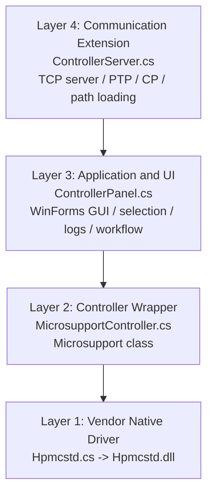
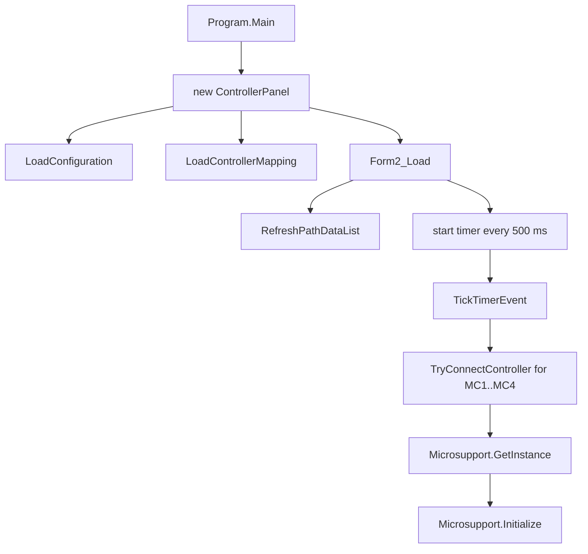

# ControllerPanel 项目说明与架构梳理

## 1. 文档定位

这份文档用于系统性说明整个 ControllerPanel 项目的功能、分层结构、文件组织和核心设计思路。

- [API_SPECIFICATION.md](API_SPECIFICATION) 主要描述 TCP 通信协议和外部接口。
- 本文档重点解释整个软件系统如何组织、如何运行、各层之间如何协作，以及关键方法各自承担什么职责。

## 2. 项目概括

本项目是一个运行在 Windows 上的 WinForms 三轴微操作器控制程序，用于控制驱动 Microsupport Quick Pro 的 MC104 控制器。软件能够同时连接最多 4 台控制器，并对指定控制器执行基础运动指令，同时扩展了一套 TCP 通信层，用于向外部路径规划程序提供状态查询、绝对步进、路径载入、PTP 轨迹执行和 CP 近似连续轨迹执行能力。


## 3. 运行环境与总体组成

### 3.1 运行环境

- 操作系统：Windows
- UI 框架：WinForms
- 目标框架：.NET Framework 4.8
- 硬件依赖：Microsupport 控制器与厂商驱动 `Hpmcstd.dll`

### 3.2 解决方案中的主要工程

- `MC104/`
  - 主 WinForms 应用工程
  - 负责 GUI、用户交互、配置读取、服务器启动和日志展示
- `MicrosupportController/`
  - 控制器封装层类库
  - 负责把底层厂商 DLL 包装为更高层、更适合业务调用的方法

### 3.3 与主程序配套但不属于核心业务代码的目录

- `MCUSB4sd-DD13/`
  - 厂商驱动、样例和旧语言绑定包
  - 是底层驱动的配套材料，不是本项目主逻辑的一部分
- `DRIVER_MANUAL.md`
  - 外部参考说明
- `assets/`
  - 根目录下的辅助资源目录，不是主程序运行时最关键的代码目录


## 4. 顶层目录与职责划分

下面是项目的主干结构，按实际作用归类而不是按所有文件逐一罗列。

```text
ControllerPanel/
|-- MC104/                         # WinForms 主程序
|   |-- Program.cs                # 应用入口
|   |-- ControllerPanel.cs        # GUI 主逻辑
|   |-- ControllerPanel.Designer.cs
|   |-- ControllerMapping.cs      # 控制器 ID 映射模型
|   |-- MicrosupportConfig.cs     # 配置模型
|   |-- Configs/
|   |   |-- controller_mapping.json
|   |   `-- microsupport_config.json
|   |-- data/                     # 离线路径 CSV
|   |-- Assets/                   # UI 图标资源
|   |-- src/server/
|   |   `-- ControllerServer.cs   # TCP 通信与轨迹执行层
|
|-- MicrosupportController/       # 控制器封装层
|   |-- MicrosupportController.cs # 高层控制逻辑
|   `-- Hpmcstd.cs                # 对 Hpmcstd.dll 的 P/Invoke 封装
|
|-- MCUSB4sd-DD13/                # 厂商驱动包与样例
`|-- DRIVER_MANUAL.md              # 控制器参考手册
`-- MC104.sln                     # 解决方案文件
`-- API_SPECIFICATION.md          # TCP API 规范
```


## 5. 四层架构

这个项目最容易理解的方式，是把它看成四层结构。



### 5.1 Layer 1: 厂商驱动层

对应文件：`MicrosupportController/Hpmcstd.cs`

这一层不负责业务逻辑，只负责把厂商 DLL 暴露出的原始函数映射到 C#。

典型底层能力包括：

- 打开和关闭设备
- 设置速度
- 启动运动
- 停止运动
- 读取状态
- 查询计数器
- 进行速度覆盖和脉冲覆盖

这一层的特点是：

- 面向设备原语
- 参数更接近硬件，而不是业务语义
- 只提供“怎么调用设备”，不回答“什么时候调用、按什么流程调用”

### 5.2 Layer 2: 控制器封装层

对应文件：`MicrosupportController/MicrosupportController.cs`

这一层把原始 DLL 调用包装为更适合上层使用的高层方法，比如：

- 把脉冲单位转换成微米单位
- 把单轴指令组合成三轴同步动作
- 提供中心坐标系和绝对坐标系之间的换算
- 提供 `StartJog`、`StartIncAll`、`StartAbsAllFromCenterAsync` 这类业务意义更明确的方法
- 提供实现伪 CP 运动所必需的 `SpeedOverride` 和 `IndexOverride`

这一层是真正的“设备控制核心”。

### 5.3 Layer 3: GUI 与应用逻辑层

对应文件：`MC104/ControllerPanel.cs`

这一层负责：

- 展示当前控制器状态
- 提供手动按钮和轨迹控制按钮
- 维护“当前选中的控制器列表”
- 周期扫描并连接最多 4 台控制器
- 接收用户输入并调用 `Microsupport` 层方法
- 启动和停止 TCP server
- 负责离线路径文件的管理与执行触发
- 格式化显示日志

### 5.4 Layer 4: 通信扩展层

对应文件：`MC104/src/server/ControllerServer.cs`

这一层是在原有三层结构之上新增的扩展层。它复用了 `Microsupport` 提供的高层控制能力，对外提供统一的 TCP 接口，用于：

- 查询状态
- 接收外部轨迹数据
- 执行绝对步进运动
- 执行 PTP 轨迹
- 执行 CP 近似连续轨迹
- 并行驱动多个微操作器

这一层是项目向“外部协同系统”开放的边界。


## 6. 关键设计思想

### 6.1 逻辑控制器与物理设备分离

在用户视角和协议视角中，控制器使用 `MC1`、`MC2`、`MC3`、`MC4` 这样的逻辑名称。

而物理设备编号由配置文件决定：

- 逻辑名称：例如 `MC1`
- 物理编号：例如 `3`

这层映射定义在 `MC104/Configs/controller_mapping.json` 中，由 `ControllerMapping` 类负责反序列化。

这样做的意义是：

- UI 和通信协议不必直接依赖实际 USB 设备编号
- 更换设备接线或重排编号时，只需要改配置文件
- 上层逻辑始终围绕稳定的逻辑 ID 运行

### 6.2 多控制器并行控制

`MicrosupportController.cs` 中定义了静态字典：

- `Microsupport.controllers`

它以逻辑名称为 key，保存当前已连接的控制器实例。上层所有操作都通过这个字典统一访问控制器。

这使得：

- GUI 能同时选择多个控制器并发送同类指令
- Server 层可以对多个控制器并行执行轨迹

### 6.3 三轴业务模型建立在四轴硬件接口之上

底层常量中定义了：

- `MC104_MAX_AXES = 4`

但上层真正暴露给业务使用的轴只有：

- `X`
- `Y`
- `Z`

这说明当前应用把底层控制卡当作三轴微操作器来使用，第四轴并没有进入业务 API。

### 6.4 统一的异步等待模型

很多高层动作采用如下模式：

1. 下发运动命令
2. 循环调用 `IsBusy()` 查询硬件状态
3. 通过 `await Task.Delay(...)` 非阻塞等待完成

这种模式把硬件的同步运动过程包装成上层可等待的异步任务，既适合 GUI，也适合 TCP server。


## 7. 坐标体系、轴映射与运动约定

这是整个项目最重要的理解点之一。

### 7.1 两套坐标表达

项目中至少存在两套常用坐标表达：

- Home/绝对坐标
  - `GetPositions()` 返回的就是设备绝对坐标
  - UI 中对应 `From Home Position`
- 中心坐标
  - `GetPositionsFromCenter()` 返回相对行程中心的位移
  - UI 和网络协议都更偏向使用这套坐标

### 7.2 运动范围

逻辑范围在代码中固定为：

- `X`: 20000 um
- `Y`: 20000 um
- `Z`: 30000 um

因此中心坐标系下的零点位于各轴行程中点。

### 7.3 中心坐标与绝对坐标的换算

在 `StartAbsAllFromCenterAsync(x, y, z, speed)` 中，中心坐标会换算为绝对坐标后再执行：

```text
X_abs = x + RANGE_X / 2
Y_abs = y + RANGE_Y / 2
Z_abs = -z + RANGE_Z / 2
```

这里最关键的是 Z 轴存在符号反转。

### 7.4 轴到硬件通道的映射

逻辑轴和硬件轴不是一一按顺序对应的：

- 逻辑 `X` -> 硬件 `MC104_AXIS2`
- 逻辑 `Y` -> 硬件 `MC104_AXIS1`
- 逻辑 `Z` -> 硬件 `MC104_AXIS3`

这组映射在以下方法中都很关键：

- `GetPositionEnc`
- `SetSpeedEnc`
- `StartJog`
- `StartIncEnc`
- `StartAbsEnc`
- `IndexOverride`
- `SpeedOverride`

这意味着上层业务代码无需关心底层轴编号顺序，但文档和调试时必须意识到这层映射存在。


## 8. 启动、连接与生命周期

### 8.1 程序启动流程

程序入口在 `MC104/Program.cs`。

启动链路如下：



### 8.2 周期扫描与连接策略

`ControllerPanel.TickTimerEvent()` 每 500ms 触发一次，承担三个职责：

- 刷新设备图标区
- 依照配置尝试连接最多 4 台控制器
- 检查已连接控制器是否仍然在线

如果控制器断开，则会：

- 调用 `Terminate()` 关闭句柄
- 从 `Microsupport.controllers` 中移除

### 8.3 关闭流程

窗体关闭时，`Form2_FormClosed()` 会：

- 停止定时器
- 遍历 `Microsupport.controllers`
- 对每个有效控制器调用 `Terminate()`
- 最后清空控制器字典

这样可以保证设备句柄被显式释放。


## 9. 配置与运行时资源

### 9.1 主配置文件

#### `MC104/Configs/microsupport_config.json`

由 `MicrosupportConfig` 读取，主要包含：

- `Resolutions`
  - `axisX`
  - `axisY`
  - `axisZ`
- `Params`
  - `maxControllers`
  - 图标大小与布局参数

这里的 `maxControllers` 直接影响 GUI 层扫描设备的上限。

#### `MC104/Configs/controller_mapping.json`

由 `ControllerMapping` 读取，定义：

- `MC1` 到 `MC4` 对应的物理设备编号

### 9.2 运行时数据目录

#### `MC104/data/`

这个目录保存离线路径 CSV 文件。GUI 中的 Server 区支持：

- 浏览和刷新路径文件列表
- 从外部复制 CSV 进入此目录
- 删除 CSV
- 将选定 CSV 加载到目标控制器的 server 轨迹缓存中

### 9.3 运行时图像资源

#### `MC104/Assets/`

用于显示设备图标与模式图标。


## 10. GUI 层功能说明

GUI 主逻辑集中在 `MC104/ControllerPanel.cs`，Designer 在 `MC104/ControllerPanel.Designer.cs`。

从界面控件命名与事件绑定来看，GUI 主要由以下几个区域组成。

### 10.1 状态显示区

包括两组坐标显示：

- `From Home Position`
- `From Midpoint of Stoke`

其作用分别是：

- 展示绝对位置
- 展示以行程中心为零点的相对位移

### 10.2 Devices 区

用于展示最多 4 台控制器的图标，并允许点击选择目标控制器。

设计特点：

- 控制器图标动态显示
- 支持多选
- 已选控制器背景高亮
- 未检测到控制器时显示离线提示

### 10.3 Control Panel 区

用于手动控制三轴运动，包括：

- Jog motion
- Step motion
- 速度调节滑条
- 原点回归
- 居中
- 急停

### 10.4 Server/Communication 区

用于通信扩展和离线路径执行，包括：

- 启动 server
- 停止 server
- 查看日志
- 选择 PTP / CP 模式
- 浏览 CSV 路径文件
- 加载路径到指定控制器
- 直接从 GUI 触发路径执行


## 11. 手动控制逻辑

### 11.1 控制器选择

所有手动操作都依赖 `selectedControllers` 列表。

这意味着：

- 用户可以只操作单个控制器
- 也可以对多个控制器同时发送相同类型的运动命令

### 11.2 Jog motion

Jog 模式由 `radioButton1` 控制。

交互方式：

- `MouseDown` 时调用 `StartJog(axis, direction)` 开始连续运动
- `MouseUp` 时调用 `StopAxis(axis)` 停止运动

这是一种持续型操作，适合人工微调。

### 11.3 Step motion

Step 模式由 `radioButton2` 控制。

交互方式：

- `MouseDown` 时调用 `StartInc(axis, direction, stepDistance)`
- 不需要 `MouseUp` 停止，因为它本质是离散步进

### 11.4 原点回归和居中

- `button_origin_Click()` 调用 `StartOriginAsync()`
- `button_center_Click()` 调用 `StartCenter()`

二者都支持对多个已选控制器同时执行。

### 11.5 急停

- `button_emgstop_Click()` 调用 `StopEmergency()`

这是最直接的安全停止手段。


## 12. 通信层设计与工作方式

通信层核心文件是 `MC104/src/server/ControllerServer.cs`。

### 12.1 角色定位

`ControllerServer` 的角色不是取代 GUI，而是把现有控制能力开放为一个 TCP 服务模块。它同时支持两种使用方式：

- 在线通信模式
  - 外部程序通过 TCP 发送协议命令
- 本地离线模式
  - GUI 直接把本地 CSV 路径加载到 server 的内部缓存后执行

### 12.2 TCP server 基本机制

`ControllerServer` 内部维护：

- `TcpListener server`
- `CancellationTokenSource cancellationTokenSource`
- `List<TcpClient> activeClients`
- `Dictionary<string, List<TrajectoryPoint>> trajectoryData`
- `Dictionary<string, bool> isPathReady`

它采用异步接受连接和异步处理客户端请求的模式：

1. `Start()` 启动监听
2. `AcceptClients()` 接受连接
3. `HandleClient()` 接收请求文本并回写响应
4. `ProcessRequest()` 将字符串命令路由到具体业务方法

### 12.3 事件回调到 GUI

`ControllerServer` 通过事件把运行信息回传给 GUI：

- `OnClientConnection`
- `OnTrajectoryReceived`

`ControllerPanel` 在启动 server 时订阅这些事件，并把它们输出到日志窗口。


## 13. 通信协议在项目中的落点

通信协议规范写在 [MC104/README.md](MC104/README.md) 中。该文档定义了请求格式和返回格式，而 `ControllerServer` 给出了对应的实现。

### 13.1 `HEARTBEAT`

- 返回 `HEARTBEAT_OK`
- 用于链路保活和联通性确认

### 13.2 `GET_STATUS`

- 解析目标控制器 ID 列表
- 对每个控制器调用 `GetPositionsFromCenter()`
- 返回 `STATUS, id, x, y, z, ...`

### 13.3 `START_STEP`

- 请求参数按 `(id, x, y, z, speed)` 成组出现
- 对每个控制器调用 `StartAbsAllFromCenterAsync(x, y, z, speed)`
- 所有运动完成后统一返回 `STEP_COMPLETED`

### 13.4 `PATH_DATA`

- 接收某个控制器的路径点序列
- 调用 `ParseAndStoreTrajectory()` 解析并缓存
- 成功后标记 `isPathReady[controllerId] = true`

### 13.5 `START_PATH_PTP`

- 立即返回 `PATH_TRACKING_PTP_STARTED`
- 后台异步执行 `PathTrackingPTP_Parallel(...)`
- 每个控制器在完成后分别发送 `PATH_COMPLETED` 或 `ERROR`

### 13.6 `START_PATH_CP`

- 立即返回 `PATH_TRACKING_CP_STARTED`
- 后台异步执行 `PathTrackingCP_Parallel(...)`
- 每个控制器独立完成、独立回传结果


## 14. 轨迹数据模型与离线执行

### 14.1 轨迹点结构

`ControllerServer` 内部定义：

```csharp
public struct TrajectoryPoint
{
    public double X, Y, Z, Speed;
    public int Index;
}
```

当前项目中核心使用字段是：

- `X`
- `Y`
- `Z`
- `Index`

### 14.2 PATH_DATA 解析策略

`ParseAndStoreTrajectory()` 的逻辑非常明确：

- 按逗号、换行、回车拆分文本
- 去掉空项
- 要求总长度必须是 3 的倍数
- 每三个值解释为一个 `(X, Y, Z)` 点

这样说明当前协议默认不直接传速度字段，而是把段时间 `duration` 作为执行阶段的外部参数。

### 14.3 离线 CSV 执行

GUI 层支持不经过外部 PathPlanner，而是直接执行本地 CSV：

1. 用户把 CSV 放到 `MC104/data/`
2. GUI 通过 `RefreshPathDataList()` 列出文件
3. `loadPathDataButton_Click()` 调用 `LoadPathDataFromFile(controllerId, filePath)`
4. `ControllerServer` 读取 CSV，跳过表头，解析路径点
5. GUI 再触发路径执行接口

这让软件即使在没有外部 MATLAB/PathPlanner 的情况下，也能本地验证轨迹执行能力。


## 15. PTP 运动原理

### 15.1 PTP 的定义

PTP 是 Point-to-Point。它的目标不是中途不断光滑过渡，而是：

- 从当前点到下一个目标点完整走完
- 每一段单独结束
- 再开始下一段

### 15.2 在项目中的实现路径

核心方法：

- `PathTrackingPTP()`
- `PathTrackingPTP_Parallel()`
- `StartSegmentSync()`

执行过程：

1. 先移动到轨迹起点
2. 对每一段 `(Pi -> Pi+1)`:
   - 调用 `StartSegmentSync()`
   - 通过 `AdjustSpeeds()` 计算三轴同步速度
   - 通过 `StartIncAll()` 发起三轴增量运动
   - 调用 `controller.Wait()` 等待该段完全结束
3. 全部结束后回传 `PATH_COMPLETED`

这种实现的特点是：

- 逻辑简单
- 稳定性高
- 每段有明显停止点
- 更接近“逐点执行”而不是“连续插补”


## 16. CP 运动原理

### 16.1 为什么要额外实现 CP

原生 Microsupport 接口并没有直接提供高层连续路径插补功能。为了得到类似 CP 的连续运动效果，本项目通过“在运动过程中动态覆盖目标脉冲和速度”的方式，构造出近似的连续运动。

这正是你在 `Microsupport` 层新增 `SpeedOverride` 和 `IndexOverride` 的意义所在。

### 16.2 CP 的实现基础

关键支撑方法分布如下：

- `Microsupport.AdjustSpeeds(...)`
- `Microsupport.SpeedOverride(...)`
- `Microsupport.IndexOverride(...)`
- `ControllerServer.CheckContinuity(...)`
- `ControllerServer.WaitForOverrideWindowAndExecute_ByTime(...)`

### 16.3 连续性判据

`CheckContinuity(p1, p2, p3)` 使用了一个很务实的连续性判断：

- 分别计算前一段和后一段在 X/Y/Z 上的位移方向
- 如果三轴的方向符号都没有翻转，则认为两段可以连续覆盖
- 只要任意一轴方向发生变化，就认定为不连续

这是一种简单、直接、易调试的连续性判据。

它的优点是：

- 实现简单
- 对底层驱动要求低
- 足够支撑“方向连续时尽量不断点”的需求

它的限制是：

- 它不是几何意义上的严格曲率连续性判断
- 更像“方向符号不变就允许连续”的工程性近似

### 16.4 时间窗口覆盖策略

`WaitForOverrideWindowAndExecute_ByTime(...)` 使用了时间近似法：

- 每段持续时间记为 `duration`
- 在 `0.85 * duration` 时尝试执行覆盖

这个比例由常量：

- `OVERRIDE_PROGRESS_PERCENT = 0.85`

控制。

这样做的意图是：

- 当前段接近完成时，提前把下一段目标脉冲和速度覆盖进去
- 让电机在尚未完全停下时继续朝下一目标点前进
- 减少逐点停顿感

### 16.5 `chainStartPoint` 的作用

在 CP 模式下，代码维护了一个 `chainStartPoint`。

它表示：

- 当前连续链条的参考起点

当连续覆盖成功时，新的目标脉冲是相对于这个连续链起点来计算的，而不是仅仅相对上一小段。这是 `IndexOverride` 能正确生效的前提之一。

### 16.6 CP 失败时的回退策略

如果发生以下任一情况：

- 连续性检查失败
- 覆盖窗口错过
- 控制器已经提前停下

系统就会回退到“停下并重新同步启动下一段”的模式：

1. `await controller.Wait()`
2. 更新 `chainStartPoint`
3. 调用 `StartSegmentSync(...)` 启动新段

因此这套 CP 实现不是“要么连续、要么失败”，而是“能连续就连续，不能连续就退化成分段执行”。

### 16.7 多控制器 CP 并行

`PathTrackingCP_Parallel(...)` 使用并行任务列表对多个控制器同时执行 CP。

每个控制器拥有：

- 自己的轨迹缓存
- 自己的执行状态
- 自己的结果回传

这意味着多个微操作器之间的并行性是在控制器粒度上实现的，而不是在单一控制器内部做共享调度。


## 17. 日志与可观测性设计

GUI 中的日志区不是简单文本框，而是整个通信层和执行层的主要可观测出口。

### 17.1 日志来源

- server 启停消息
- 客户端连接/断开消息
- 协议请求和响应消息
- 轨迹接收消息
- CP/PTP 运动进度消息
- 错误消息

### 17.2 设计特点

- 自动补时间戳
- 根据关键字更新状态显示
- 自动滚动到最后一行
- 日志过多时自动截断，避免 UI 文本无限增长
- 可保存为 `.log` 或 `.txt`

这使得 GUI 同时承担了“控制面板”和“调试监视台”的双重角色。


## 18. 关键方法清单

这一节按文件整理关键方法，并说明它们的职责。这里不追求把每个内部私有细节都展开，而是突出真正参与主链路的方法。

### 18.1 `MC104/Program.cs`

| 方法 | 作用 |
| --- | --- |
| `Main(string[] args)` | WinForms 应用入口，创建并运行 `ControllerPanel` 主窗体。 |

### 18.2 `MC104/ControllerMapping.cs`

| 方法/属性 | 作用 |
| --- | --- |
| `Controllers` | 保存逻辑控制器 ID 到物理设备编号的映射。 |
| `LoadFromFile(string filePath)` | 从 JSON 文件读取控制器映射。 |

### 18.3 `MC104/MicrosupportConfig.cs`

| 方法/属性 | 作用 |
| --- | --- |
| `Resolutions` | 保存三轴分辨率。 |
| `Params` | 保存最大控制器数量和界面布局参数。 |
| `LoadFromFile(string filePath)` | 从 JSON 读取整体配置。 |

### 18.4 `MC104/ControllerPanel.cs`

| 方法 | 作用 |
| --- | --- |
| `ControllerPanel()` | 初始化窗体并读取配置与控制器映射。 |
| `Form2_Load(...)` | 刷新路径文件列表并启动 500ms 定时器。 |
| `Form2_FormClosed(...)` | 停止定时器并释放所有控制器句柄。 |
| `RefreshControllerArea()` | 刷新设备图标、设备标签与离线状态提示。 |
| `TickTimerEvent(...)` | 周期扫描控制器、清理掉线设备、刷新当前位置。 |
| `TryConnectController(int controllerId)` | 通过映射表尝试连接指定逻辑控制器。 |
| `controllerIconClick(...)` | 切换控制器选中状态。 |
| `GetAxisDirection(...)` | 根据按钮名称解析出对应轴与方向。 |
| `buttons_MouseDown(...)` | 在 Jog/Step 模式下触发连续运动或步进运动。 |
| `buttons_MouseUp(...)` | Jog 模式下停止指定轴运动。 |
| `trackBar1_Scroll(...)` | 调整选中控制器的运动速度。 |
| `button_origin_Click(...)` | 对选中控制器执行原点回归。 |
| `button_emgstop_Click(...)` | 对选中控制器执行急停。 |
| `button_center_Click(...)` | 对选中控制器执行居中。 |
| `StartServerButton_Click(...)` | 创建并启动 `ControllerServer`，绑定日志事件。 |
| `StopServerButton_Click(...)` | 停止 `ControllerServer` 并恢复界面按钮状态。 |
| `OnTrajectoryReceived(...)` | 在 GUI 日志区显示轨迹接收通知。 |
| `LogMessage(string message)` | 统一日志输出、状态更新和日志截断。 |
| `LoadConfiguration(...)` | 读取主配置文件。 |
| `LoadControllerMapping(...)` | 读取逻辑控制器与物理设备映射。 |
| `RefreshPathDataList()` | 刷新 `data/` 目录下的 CSV 文件列表。 |
| `addPathDataButton_Click(...)` | 从外部导入 CSV 到 `data/` 目录。 |
| `removePathDataButton_Click(...)` | 删除选中的路径文件。 |
| `loadPathDataButton_Click(...)` | 将所选 CSV 载入选中控制器的 server 轨迹缓存。 |
| `startPathTrackingButton_Click(...)` | 按所选模式触发轨迹执行。 |

### 18.5 `MicrosupportController/MicrosupportController.cs`

| 方法 | 作用 |
| --- | --- |
| `GetInstance(string name, int deviceId)` | 用单例/缓存方式获取某个控制器实例。 |
| `Microsupport(ushort ID)` | 构造时直接执行初始化。 |
| `Initialize(ushort ID)` | 打开设备并配置各轴脉冲模式、限位和停止策略。 |
| `IsConnected()` | 用状态查询判断控制器是否仍在线。 |
| `StartOrigin(ushort axis, ushort action)` | 对单轴下发回原点命令。 |
| `StartOriginAsync()` | 对三轴执行原点回归并等待完成。 |
| `StartCenter()` | 把三轴移动到行程中心位置。 |
| `Enc2um(...)` | 将编码器脉冲换算为微米。 |
| `Um2enc(...)` | 将微米换算为编码器脉冲。 |
| `GetPositionsEnc()` | 获取底层计数器值。 |
| `GetPositionEnc(AXIS axis)` | 获取某一逻辑轴的脉冲位置。 |
| `GetPositions()` | 获取绝对坐标系下的三轴位置。 |
| `GetPositionsFromCenter()` | 获取以行程中心为原点的三轴位置。 |
| `SetSpeedEnc(...)` | 按脉冲速度配置某轴速度曲线。 |
| `SetSpeed(...)` | 按微米速度配置某轴速度。 |
| `GetSpeedEnc(...)` | 读取某轴的脉冲速度设置。 |
| `GetSpeed(...)` | 读取某轴的微米速度设置。 |
| `SetSpeeds(double speed)` | 批量设置三轴速度。 |
| `AdjustSpeeds(dx, dy, dz, duration)` | 按位移和段时间计算同步速度，并用 `SpeedOverride` 覆盖。 |
| `StopAxis(AXIS axis)` | 单轴减速停止。 |
| `Stop()` | 三轴统一减速停止。 |
| `StopAxisEmergency(AXIS axis)` | 单轴急停。 |
| `StopEmergency()` | 三轴统一急停。 |
| `StartJog(AXIS axis, DIRECTION direction)` | 启动单轴 Jog 连续运动。 |
| `StartIncEnc(...)` | 按脉冲数启动单轴增量运动。 |
| `StartInc(...)` | 按微米值启动单轴增量运动。 |
| `StartIncAll(...)` | 对三轴同时下发增量运动。 |
| `StartAbsEnc(...)` | 单轴绝对位置运动。 |
| `StartAbs(...)` | 单轴按微米绝对运动。 |
| `StartAbsAll(...)` | 三轴按绝对坐标同步运动。 |
| `StartAbsAllFromCenterAsync(...)` | 三轴按中心坐标同步运动并等待完成。 |
| `IndexOverride(...)` | 在运动过程中覆盖目标脉冲数。 |
| `SpeedOverride(...)` | 在运动过程中覆盖轴速度。 |
| `Wait()` | 轮询 `IsBusy()` 直到控制器空闲。 |
| `Terminate()` | 关闭设备句柄。 |
| `IsBusy()` | 查询三轴是否仍在运动。 |
| `IsBusy(AXIS axis)` | 查询单轴是否仍在运动。 |
| `GetError(uint errorCode)` | 将错误码翻译为错误字符串。 |
| `GetAxisEndStatus(AXIS axis)` | 读取指定轴的结束状态。 |
| `GetEndStatus(uint status)` | 读取整体结束状态。 |

### 18.6 `MC104/src/server/ControllerServer.cs`

| 方法 | 作用 |
| --- | --- |
| `ControllerServer(int port = 5000)` | 构造 TCP server 并设置监听端口。 |
| `Start()` | 启动监听并开始后台接受客户端。 |
| `Stop()` | 停止监听并关闭所有活动连接。 |
| `AcceptClients(...)` | 持续接受客户端连接。 |
| `HandleClient(...)` | 读取请求、调用路由逻辑、写回响应。 |
| `IsSocketConnected(Socket socket)` | 检查套接字是否仍有效。 |
| `ProcessRequest(string request, NetworkStream stream)` | 协议命令总入口，负责分发到具体处理方法。 |
| `SendStatus(params string[] ids)` | 对指定控制器生成状态响应。 |
| `ProcessPathData(string controllerId, string rawData)` | 提取 `PATH_DATA` 负载并触发解析存储。 |
| `LoadPathDataFromFile(string controllerId, string filePath)` | 从本地 CSV 读取路径并缓存。 |
| `ParseAndStoreTrajectory(string controllerId, string payload)` | 将文本路径解析为 `TrajectoryPoint` 列表。 |
| `PathTrackingPTP(string id, double duration)` | 对单个控制器执行 PTP 路径。 |
| `PathTrackingPTP_Parallel(List<string> ids, double duration, NetworkStream stream)` | 对多个控制器并行执行 PTP，并逐个回写结果。 |
| `PathTrackingCP(string id, double duration)` | 对单个控制器执行 CP 近似连续路径。 |
| `PathTrackingCP_Parallel(List<string> ids, double duration, NetworkStream stream)` | 对多个控制器并行执行 CP，并逐个回写结果。 |
| `CheckContinuity(...)` | 判断连续覆盖是否允许继续。 |
| `StartSegmentSync(...)` | 按段时间计算速度后，启动三轴同步增量运动。 |
| `WaitForOverrideWindowAndExecute_ByTime(...)` | 在时间窗口到达时执行速度/脉冲覆盖。 |
| `NotifyClientConnection(string message)` | 把消息派发到 GUI 日志事件。 |

### 18.7 `MicrosupportController/Hpmcstd.cs`

这个文件很大，但项目主链路最关键的原生函数主要是以下这些。

| 原生函数 | 作用 |
| --- | --- |
| `McsdOpen(...)` | 打开设备并返回句柄。 |
| `McsdClose(...)` | 关闭设备句柄。 |
| `McsdSetPulseMode(...)` | 配置脉冲输出模式。 |
| `McsdSetLimit(...)` | 配置限位输入模式。 |
| `McsdSetSignalStop(...)` | 配置信号触发停止行为。 |
| `McsdSetSpeed(...)` | 设置运动速度曲线。 |
| `McsdGetSpeed(...)` | 读取速度曲线参数。 |
| `McsdGetStatus(...)` | 获取轴状态。 |
| `McsdGetAxisBusy(...)` | 获取是否忙碌的状态位。 |
| `McsdGetCounter(...)` | 读取内部计数器。 |
| `McsdDriveStart(...)` | 启动 INDEX 或 SCAN 类型运动。 |
| `McsdDriveStop(...)` | 停止运动。 |
| `McsdOrgReturn(...)` | 执行原点回归。 |
| `McsdHiSpeedOverride(...)` | 在运动中覆盖速度。 |
| `McsdIndexOverride(...)` | 在运动中覆盖目标脉冲。 |


## 19. 三条最重要的调用链

### 19.1 手动 Jog 调用链

```text
用户按下方向按钮
-> ControllerPanel.buttons_MouseDown()
-> GetAxisDirection()
-> Microsupport.SetSpeed(axis, speed)
-> Microsupport.StartJog(axis, direction)
-> Hpmcstd.McsdDriveStart(... SCAN ...)

用户松开按钮
-> ControllerPanel.buttons_MouseUp()
-> Microsupport.StopAxis(axis)
-> Hpmcstd.McsdDriveStop(...)
```

### 19.2 TCP 绝对步进调用链

```text
外部发送 START_STEP
-> ControllerServer.HandleClient()
-> ControllerServer.ProcessRequest()
-> Microsupport.StartAbsAllFromCenterAsync(x, y, z, speed)
-> Microsupport.StartAbsAll(...)
-> Microsupport.AdjustSpeeds(...)
-> Microsupport.StartIncAll(...)
-> Hpmcstd.McsdDriveStart(...)
-> Wait until finished
-> 返回 STEP_COMPLETED
```

### 19.3 CP 路径执行调用链

```text
外部发送 PATH_DATA
-> ControllerServer.ProcessPathData()
-> ParseAndStoreTrajectory()

外部发送 START_PATH_CP
-> ControllerServer.ProcessRequest()
-> PathTrackingCP_Parallel(...)
-> PathTrackingCP(id, duration)
-> StartSegmentSync(P0, P1)
-> WaitForOverrideWindowAndExecute_ByTime(...)
-> Microsupport.AdjustSpeeds(...)
-> Microsupport.SpeedOverride(...)
-> Microsupport.IndexOverride(...)
-> 连续覆盖或回退到重新同步
-> 返回 PATH_COMPLETED / ERROR
```


## 20. 主运行路径之外但值得说明的文件

以下文件虽然存在于仓库中，但不属于当前核心控制链路：

- `MC104/test/`
  - 已按本文档约定忽略
- `KinematicSolver/`
  - 已按本文档约定忽略
- `MicrosupportController/MicrosupportController.cs.bak`
  - 备份文件，不是主编译目标
- `MC104/Form2-HIROYAOF876.cs`
  - 未纳入当前主说明链路，且不在主要工程引用路径中
- `MCUSB4sd-DD13/Samples/`
  - 厂商样例工程，仅作参考


## 21. 对整个项目设计的总结

这个项目的核心价值不只是“能让按钮动起来”，而是把一个厂商硬件驱动逐层提升成了一个可以被 GUI、人和外部路径规划器共同使用的控制平台。

如果用一句更工程化的话来概括：

- 最底层提供设备原语
- 中间层把设备原语整理成三轴微操作器的业务 API
- GUI 层提供人机交互与状态可视化
- TCP 层把同一套控制能力开放为可编排、可集成的外部接口

其中最有技术含量的扩展点是 CP 轨迹执行方案：

- 由于原生硬件接口不直接提供高级连续轨迹能力
- 项目改用 `SpeedOverride + IndexOverride + 时间窗口覆盖` 的组合方式，逼近连续路径效果
- 再通过 `PathTrackingCP_Parallel(...)` 把这个能力推广到多控制器并行场景

因此，这个项目本质上已经不是一个单纯的手动控制面板，而是一个围绕 Microsupport 控制器构建的小型运动控制应用平台。